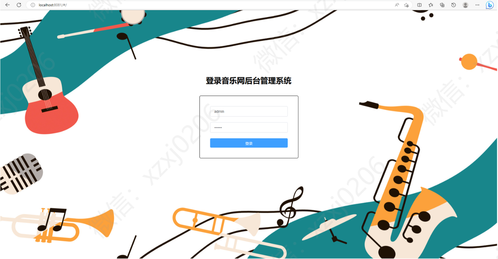
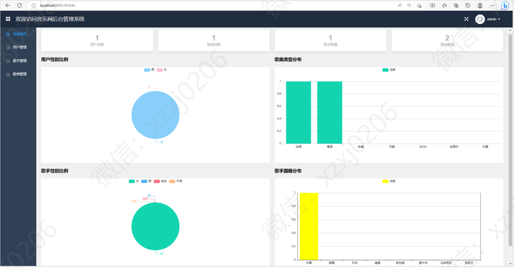
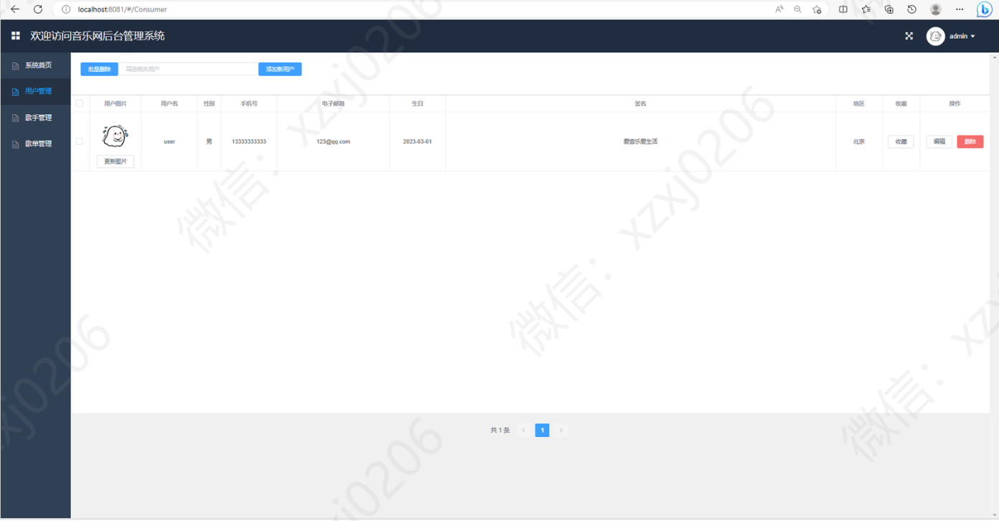
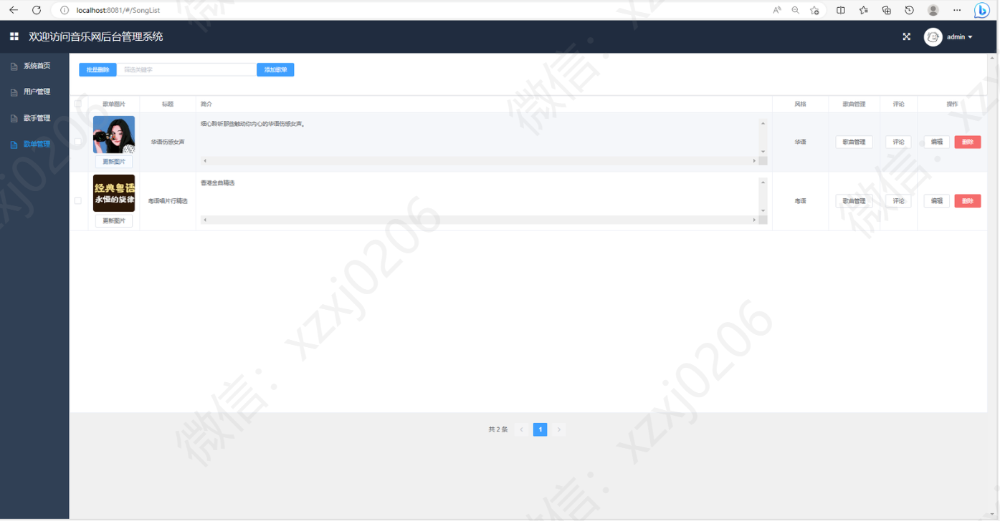
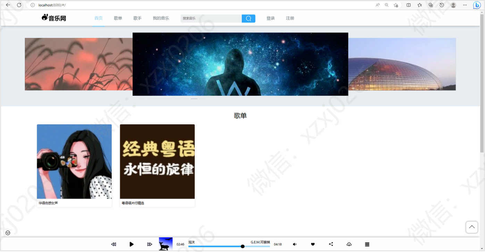
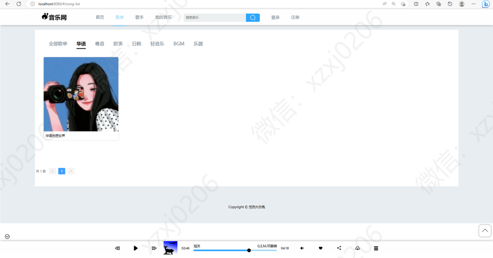
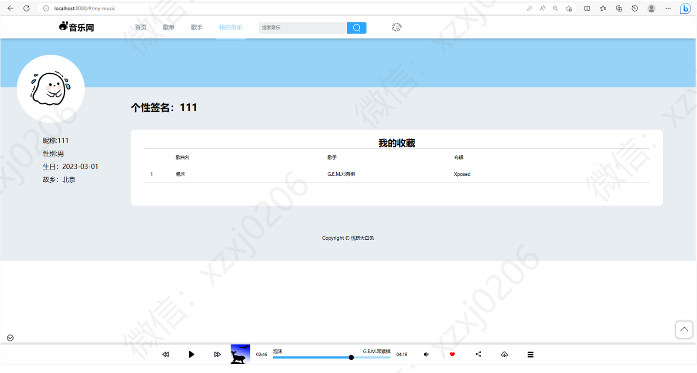
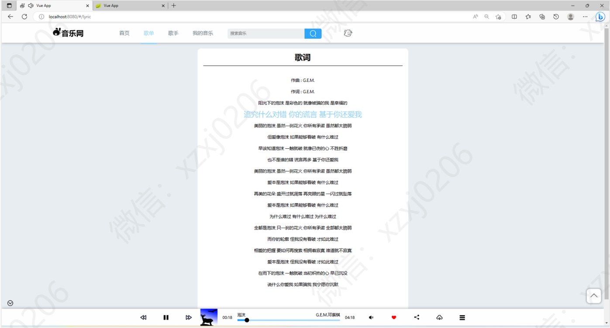

、# 音乐系统网站

### 完整项目获取

通过网盘分享的文件：音乐系统

链接: https://pan.baidu.com/s/1Eh391ZFv5wSYQKe_XCtSFg?pwd=47qx 提取码: 47qx --来自百度网盘超级会员v3的分享

通过网盘分享的文件：工具包

链接: https://pan.baidu.com/s/1YmdoJvkjoUjA75wvHLDZ6A?pwd=xm96 提取码: xm96
--来自百度网盘超级会员v3的分享

需要远程项目部署或项目修改和毕业设计也可联系（添加申请时请备注好来意）

通过网盘分享的文件：远程调试部署联系方式

链接: https://pan.baidu.com/s/1W0dDcoZmayG0c7USJDYBYg?pwd=nqd7 提取码: nqd7
--来自百度网盘超级会员v3的分享

### 项目合集(项目不断更新中)
链接: https://pan.baidu.com/s/1nY-zhvAK0CXYcn3g7LzQnQ?pwd=id3c 提取码: id3c
--来自百度网盘超级会员v3的分享

#### 这些项目一起发你了 可以分享给你需要的同学 调试可找我 也接二次修改和项目定制、毕业设计等

## 接毕业设计和论文

微信联系方式：xzxj0206  QQ：3808981644   (支持修改、 部署调试、 支持代做毕设)

接网站建设、小程序、H5、APP、各种系统等，单片机、嵌入式也可以做

选题+开题报告+任务书+程序定制+安装调试+论文+答辩ppt  都可以做

## 一、介绍
基于SpringBoot，Mybatis，Vue的前后端分离音乐在线系统网站

语言：java

运行工具：idea或eclipse vscode 数据库：mysql

主要功能:

音乐播放 

用户登录注册、用户信息编辑、头像修改

歌曲、歌单搜索、歌单打分

歌单、歌曲评论、歌单列表、歌手列表分页显示、歌词同步显示

音乐收藏、下载、拖动控制、音量控制

后台对用户、歌曲、歌手、歌单信息的管理

## 二、后台功能部分页面展示

## 二、前台功能部分页面展示

