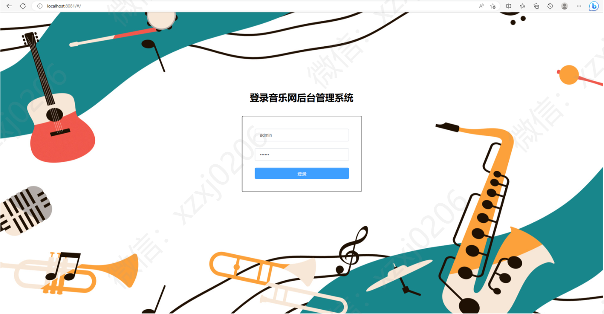
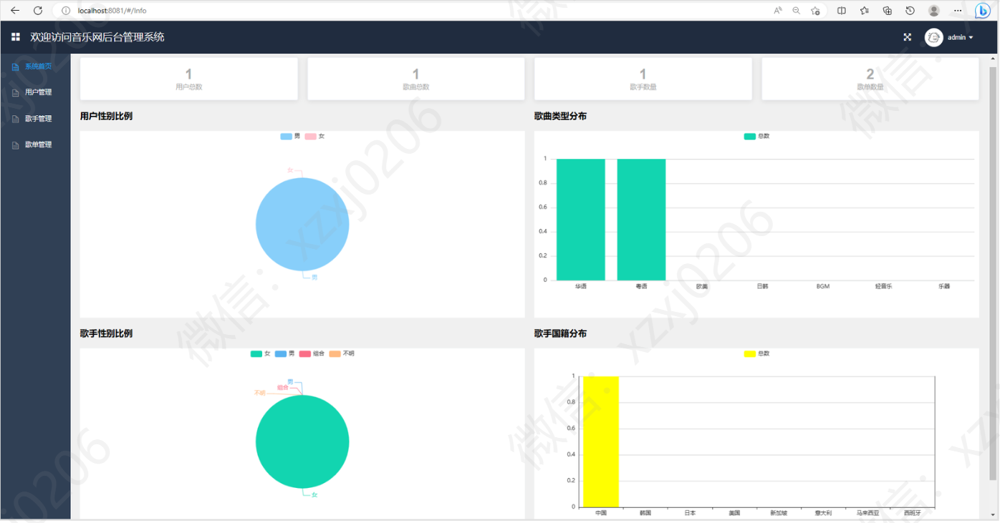
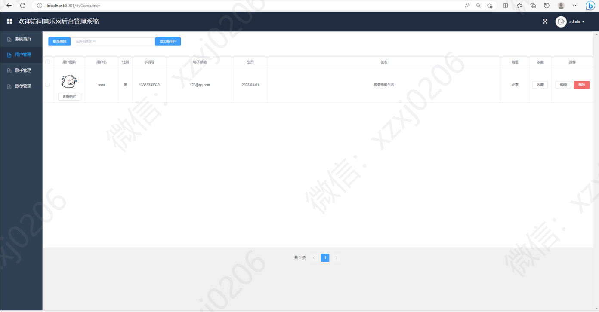
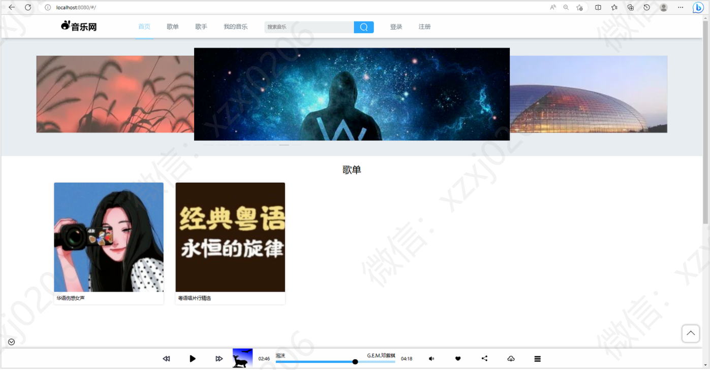
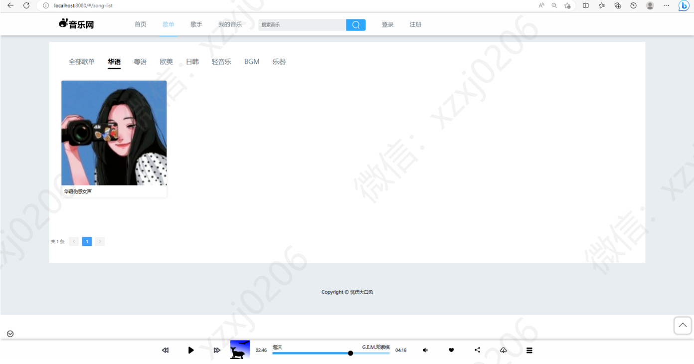

# 音乐系统网站

### 更多项目： https://github.com/34426?tab=repositories

## 一、介绍
基于SpringBoot，Mybatis，Vue的前后端分离音乐在线系统网站

语言：java

运行工具：idea或eclipse vscode 数据库：mysql

主要功能:

音乐播放 

用户登录注册、用户信息编辑、头像修改

歌曲、歌单搜索、歌单打分

歌单、歌曲评论、歌单列表、歌手列表分页显示、歌词同步显示

音乐收藏、下载、拖动控制、音量控制

后台对用户、歌曲、歌手、歌单信息的管理

## 二、后台功能部分页面展示

## 二、前台功能部分页面展示

## 9.9￥ 获取完整源码+sql，需要加Q：3577148218 ,备用Q: 3808981644
## 有问题，或者需要协助调试运行项目的也可联系

